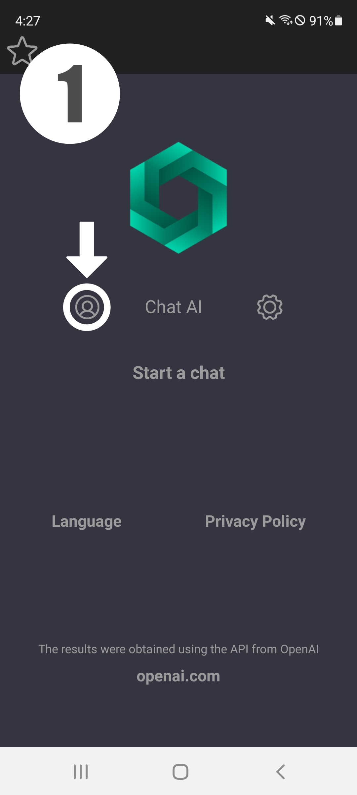
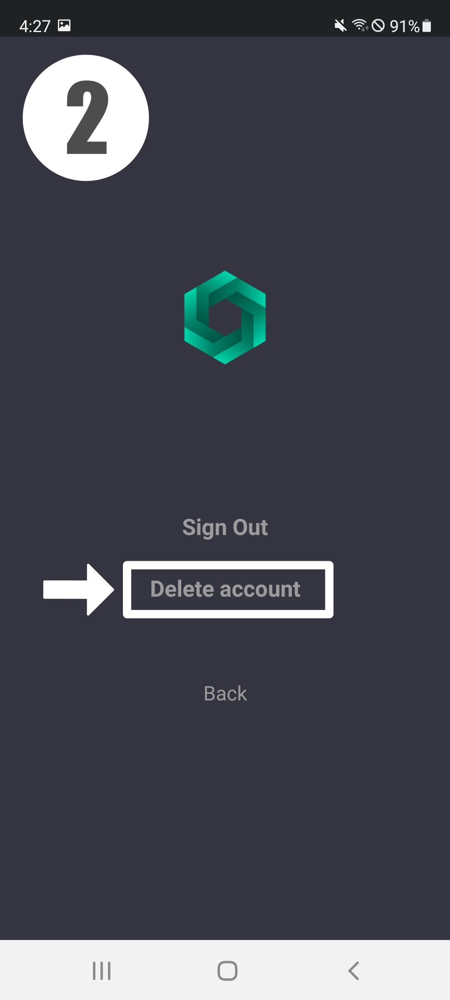

## SimpleAppsPro

Install our awesome apps and enjoy! =).

### FF: Nickname Generator

**Privacy Policy**

SimpleAppsPro built the FF: Nickname Generator app as a Free app. This SERVICE is provided by SimpleAppsPro at no cost and is intended for use as is.

This page is used to inform visitors regarding our policies with the collection, use, and disclosure of Personal Information if anyone decided to use our Service.

If you choose to use our Service, then you agree to the collection and use of information in relation to this policy. The Personal Information that we collect is used for providing and improving the Service. We will not use or share your information with anyone except as described in this Privacy Policy.

The terms used in this Privacy Policy have the same meanings as in our Terms and Conditions, which is accessible at FF: Nickname Generator unless otherwise defined in this Privacy Policy.

**Information Collection and Use**

For a better experience, while using our Service, we may require you to provide us with certain personally identifiable information. The information that we request will be retained by us and used as described in this privacy policy.

The app does use third party services that may collect information used to identify you.

Link to privacy policy of third party service providers used by the app

*   [Google Play Services](https://www.google.com/policies/privacy/)
*   [AdMob](https://support.google.com/admob/answer/6128543?hl=en)

**Log Data**

We want to inform you that whenever you use our Service, in a case of an error in the app we collect data and information (through third party products) on your phone called Log Data. This Log Data may include information such as your device Internet Protocol (“IP”) address, device name, operating system version, the configuration of the app when utilizing our Service, the time and date of your use of the Service, and other statistics.

**Cookies**

Cookies are files with a small amount of data that are commonly used as anonymous unique identifiers. These are sent to your browser from the websites that you visit and are stored on your device's internal memory.

This Service does not use these “cookies” explicitly. However, the app may use third party code and libraries that use “cookies” to collect information and improve their services. You have the option to either accept or refuse these cookies and know when a cookie is being sent to your device. If you choose to refuse our cookies, you may not be able to use some portions of this Service.

**Service Providers**

We may employ third-party companies and individuals due to the following reasons:

*   To facilitate our Service;
*   To provide the Service on our behalf;
*   To perform Service-related services; or
*   To assist us in analyzing how our Service is used.

We want to inform users of this Service that these third parties have access to your Personal Information. The reason is to perform the tasks assigned to them on our behalf. However, they are obligated not to disclose or use the information for any other purpose.

**Security**

We value your trust in providing us your Personal Information, thus we are striving to use commercially acceptable means of protecting it. But remember that no method of transmission over the internet, or method of electronic storage is 100% secure and reliable, and we cannot guarantee its absolute security.

**Links to Other Sites**

This Service may contain links to other sites. If you click on a third-party link, you will be directed to that site. Note that these external sites are not operated by us. Therefore, we strongly advise you to review the Privacy Policy of these websites. We have no control over and assume no responsibility for the content, privacy policies, or practices of any third-party sites or services.

**Children’s Privacy**

These Services do not address anyone under the age of 13. We do not knowingly collect personally identifiable information from children under 13 years of age. In the case we discover that a child under 13 has provided us with personal information, we immediately delete this from our servers. If you are a parent or guardian and you are aware that your child has provided us with personal information, please contact us so that we will be able to do necessary actions.

**Changes to This Privacy Policy**

We may update our Privacy Policy from time to time. Thus, you are advised to review this page periodically for any changes. We will notify you of any changes by posting the new Privacy Policy on this page.

This policy is effective as of 2021-11-18

### Gas Station Guide

**Privacy Policy**

Simple Apps Pro built the Gas Station Guide app as a Free app. This SERVICE is provided by Simple Apps Pro at no cost and is intended for use as is.

This page is used to inform visitors regarding our policies with the collection, use, and disclosure of Personal Information if anyone decided to use our Service.

If you choose to use our Service, then you agree to the collection and use of information in relation to this policy. The Personal Information that we collect is used for providing and improving the Service. We will not use or share your information with anyone except as described in this Privacy Policy.

The terms used in this Privacy Policy have the same meanings as in our Terms and Conditions, which are accessible at Gas Station Guide unless otherwise defined in this Privacy Policy.

**Information Collection and Use**

For a better experience, while using our Service, we may require you to provide us with certain personally identifiable information. The information that we request will be retained by us and used as described in this privacy policy.

The app does use third-party services that may collect information used to identify you.

Link to the privacy policy of third-party service providers used by the app

*   [Google Play Services](https://www.google.com/policies/privacy/)
*   [AdMob](https://support.google.com/admob/answer/6128543?hl=en)

**Log Data**

We want to inform you that whenever you use our Service, in a case of an error in the app we collect data and information (through third-party products) on your phone called Log Data. This Log Data may include information such as your device Internet Protocol (“IP”) address, device name, operating system version, the configuration of the app when utilizing our Service, the time and date of your use of the Service, and other statistics.

**Cookies**

Cookies are files with a small amount of data that are commonly used as anonymous unique identifiers. These are sent to your browser from the websites that you visit and are stored on your device's internal memory.

This Service does not use these “cookies” explicitly. However, the app may use third-party code and libraries that use “cookies” to collect information and improve their services. You have the option to either accept or refuse these cookies and know when a cookie is being sent to your device. If you choose to refuse our cookies, you may not be able to use some portions of this Service.

**Service Providers**

We may employ third-party companies and individuals due to the following reasons:

*   To facilitate our Service;
*   To provide the Service on our behalf;
*   To perform Service-related services; or
*   To assist us in analyzing how our Service is used.

We want to inform users of this Service that these third parties have access to their Personal Information. The reason is to perform the tasks assigned to them on our behalf. However, they are obligated not to disclose or use the information for any other purpose.

**Security**

We value your trust in providing us your Personal Information, thus we are striving to use commercially acceptable means of protecting it. But remember that no method of transmission over the internet, or method of electronic storage is 100% secure and reliable, and we cannot guarantee its absolute security.

**Links to Other Sites**

This Service may contain links to other sites. If you click on a third-party link, you will be directed to that site. Note that these external sites are not operated by us. Therefore, we strongly advise you to review the Privacy Policy of these websites. We have no control over and assume no responsibility for the content, privacy policies, or practices of any third-party sites or services.

**Children’s Privacy**

These Services do not address anyone under the age of 13. We do not knowingly collect personally identifiable information from children under 13 years of age. In the case we discover that a child under 13 has provided us with personal information, we immediately delete this from our servers. If you are a parent or guardian and you are aware that your child has provided us with personal information, please contact us so that we will be able to do the necessary actions.

**Changes to This Privacy Policy**

We may update our Privacy Policy from time to time. Thus, you are advised to review this page periodically for any changes. We will notify you of any changes by posting the new Privacy Policy on this page.

This policy is effective as of 2021-11-23

### Fake Messenger

**Privacy Policy**

Simple Apps Pro built the Fake Messenger app as a Free app. This SERVICE is provided by Simple Apps Pro at no cost and is intended for use as is.

This page is used to inform visitors regarding our policies with the collection, use, and disclosure of Personal Information if anyone decided to use our Service.

If you choose to use our Service, then you agree to the collection and use of information in relation to this policy. The Personal Information that we collect is used for providing and improving the Service. We will not use or share your information with anyone except as described in this Privacy Policy.

The terms used in this Privacy Policy have the same meanings as in our Terms and Conditions, which are accessible at Fake Messenger unless otherwise defined in this Privacy Policy.

**Information Collection and Use**

For a better experience, while using our Service, we may require you to provide us with certain personally identifiable information. The information that we request will be retained by us and used as described in this privacy policy.

The app does use third-party services that may collect information used to identify you.

Link to the privacy policy of third-party service providers used by the app

*   [Google Play Services](https://www.google.com/policies/privacy/)
*   [AdMob](https://support.google.com/admob/answer/6128543?hl=en)
*   [Unity Ads](https://unity.com/legal/privacy-policy)

**Log Data**

We want to inform you that whenever you use our Service, in a case of an error in the app we collect data and information (through third-party products) on your phone called Log Data. This Log Data may include information such as your device Internet Protocol (“IP”) address, device name, operating system version, the configuration of the app when utilizing our Service, the time and date of your use of the Service, and other statistics.

**Cookies**

Cookies are files with a small amount of data that are commonly used as anonymous unique identifiers. These are sent to your browser from the websites that you visit and are stored on your device's internal memory.

This Service does not use these “cookies” explicitly. However, the app may use third-party code and libraries that use “cookies” to collect information and improve their services. You have the option to either accept or refuse these cookies and know when a cookie is being sent to your device. If you choose to refuse our cookies, you may not be able to use some portions of this Service.

**Service Providers**

We may employ third-party companies and individuals due to the following reasons:

*   To facilitate our Service;
*   To provide the Service on our behalf;
*   To perform Service-related services; or
*   To assist us in analyzing how our Service is used.

We want to inform users of this Service that these third parties have access to their Personal Information. The reason is to perform the tasks assigned to them on our behalf. However, they are obligated not to disclose or use the information for any other purpose.

**Security**

We value your trust in providing us your Personal Information, thus we are striving to use commercially acceptable means of protecting it. But remember that no method of transmission over the internet, or method of electronic storage is 100% secure and reliable, and we cannot guarantee its absolute security.

**Links to Other Sites**

This Service may contain links to other sites. If you click on a third-party link, you will be directed to that site. Note that these external sites are not operated by us. Therefore, we strongly advise you to review the Privacy Policy of these websites. We have no control over and assume no responsibility for the content, privacy policies, or practices of any third-party sites or services.

**Children’s Privacy**

These Services do not address anyone under the age of 13. We do not knowingly collect personally identifiable information from children under 13 years of age. In the case we discover that a child under 13 has provided us with personal information, we immediately delete this from our servers. If you are a parent or guardian and you are aware that your child has provided us with personal information, please contact us so that we will be able to do the necessary actions.

**Changes to This Privacy Policy**

We may update our Privacy Policy from time to time. Thus, you are advised to review this page periodically for any changes. We will notify you of any changes by posting the new Privacy Policy on this page.

This policy is effective as of 2021-11-27

### Downloader for TikTok

**Privacy Policy**

SimpleAppsPro built the Downloader for TikTok app as a Free app. This SERVICE is provided by SimpleAppsPro at no cost and is intended for use as is.

This page is used to inform visitors regarding my policies with the collection, use, and disclosure of Personal Information if anyone decided to use my Service.

If you choose to use my Service, then you agree to the collection and use of information in relation to this policy. The Personal Information that I collect is used for providing and improving the Service. I will not use or share your information with anyone except as described in this Privacy Policy.

The terms used in this Privacy Policy have the same meanings as in our Terms and Conditions, which are accessible at Downloader for TikTok unless otherwise defined in this Privacy Policy.

**Information Collection and Use**

For a better experience, while using our Service, I may require you to provide us with certain personally identifiable information. The information that I request will be retained on your device and is not collected by me in any way.

The app does use third-party services that may collect information used to identify you.

Link to the privacy policy of third-party service providers used by the app

*   [Google Play Services](https://www.google.com/policies/privacy/)
*   [AdMob](https://support.google.com/admob/answer/6128543?hl=en)

**Log Data**

I want to inform you that whenever you use my Service, in a case of an error in the app I collect data and information (through third-party products) on your phone called Log Data. This Log Data may include information such as your device Internet Protocol (“IP”) address, device name, operating system version, the configuration of the app when utilizing my Service, the time and date of your use of the Service, and other statistics.

**Cookies**

Cookies are files with a small amount of data that are commonly used as anonymous unique identifiers. These are sent to your browser from the websites that you visit and are stored on your device's internal memory.

This Service does not use these “cookies” explicitly. However, the app may use third-party code and libraries that use “cookies” to collect information and improve their services. You have the option to either accept or refuse these cookies and know when a cookie is being sent to your device. If you choose to refuse our cookies, you may not be able to use some portions of this Service.

**Service Providers**

I may employ third-party companies and individuals due to the following reasons:

*   To facilitate our Service;
*   To provide the Service on our behalf;
*   To perform Service-related services; or
*   To assist us in analyzing how our Service is used.

I want to inform users of this Service that these third parties have access to their Personal Information. The reason is to perform the tasks assigned to them on our behalf. However, they are obligated not to disclose or use the information for any other purpose.

**Security**

I value your trust in providing us your Personal Information, thus we are striving to use commercially acceptable means of protecting it. But remember that no method of transmission over the internet, or method of electronic storage is 100% secure and reliable, and I cannot guarantee its absolute security.

**Links to Other Sites**

This Service may contain links to other sites. If you click on a third-party link, you will be directed to that site. Note that these external sites are not operated by me. Therefore, I strongly advise you to review the Privacy Policy of these websites. I have no control over and assume no responsibility for the content, privacy policies, or practices of any third-party sites or services.

**Children’s Privacy**

These Services do not address anyone under the age of 13. I do not knowingly collect personally identifiable information from children under 13 years of age. In the case I discover that a child under 13 has provided me with personal information, I immediately delete this from our servers. If you are a parent or guardian and you are aware that your child has provided us with personal information, please contact me so that I will be able to do the necessary actions.

**Changes to This Privacy Policy**

I may update our Privacy Policy from time to time. Thus, you are advised to review this page periodically for any changes. I will notify you of any changes by posting the new Privacy Policy on this page.

This policy is effective as of 2022-04-01

### Dog Breeds

**Privacy Policy**

SimpleAppsPro built the Dog Breeds app as a Free app. This SERVICE is provided by SimpleAppsPro at no cost and is intended for use as is.

This page is used to inform visitors regarding our policies with the collection, use, and disclosure of Personal Information if anyone decided to use our Service.

If you choose to use our Service, then you agree to the collection and use of information in relation to this policy. The Personal Information that we collect is used for providing and improving the Service. We will not use or share your information with anyone except as described in this Privacy Policy.

The terms used in this Privacy Policy have the same meanings as in our Terms and Conditions, which are accessible at Dog Breeds unless otherwise defined in this Privacy Policy.

**Information Collection and Use**

For a better experience, while using our Service, we may require you to provide us with certain personally identifiable information. The information that we request will be retained by us and used as described in this privacy policy.

The app does use third-party services that may collect information used to identify you.

Link to the privacy policy of third-party service providers used by the app

*   [Google Play Services](https://www.google.com/policies/privacy/)
*   [AdMob](https://support.google.com/admob/answer/6128543?hl=en)

**Log Data**

We want to inform you that whenever you use our Service, in a case of an error in the app we collect data and information (through third-party products) on your phone called Log Data. This Log Data may include information such as your device Internet Protocol (“IP”) address, device name, operating system version, the configuration of the app when utilizing our Service, the time and date of your use of the Service, and other statistics.

**Cookies**

Cookies are files with a small amount of data that are commonly used as anonymous unique identifiers. These are sent to your browser from the websites that you visit and are stored on your device's internal memory.

This Service does not use these “cookies” explicitly. However, the app may use third-party code and libraries that use “cookies” to collect information and improve their services. You have the option to either accept or refuse these cookies and know when a cookie is being sent to your device. If you choose to refuse our cookies, you may not be able to use some portions of this Service.

**Service Providers**

We may employ third-party companies and individuals due to the following reasons:

*   To facilitate our Service;
*   To provide the Service on our behalf;
*   To perform Service-related services; or
*   To assist us in analyzing how our Service is used.

We want to inform users of this Service that these third parties have access to their Personal Information. The reason is to perform the tasks assigned to them on our behalf. However, they are obligated not to disclose or use the information for any other purpose.

**Security**

We value your trust in providing us your Personal Information, thus we are striving to use commercially acceptable means of protecting it. But remember that no method of transmission over the internet, or method of electronic storage is 100% secure and reliable, and we cannot guarantee its absolute security.

**Links to Other Sites**

This Service may contain links to other sites. If you click on a third-party link, you will be directed to that site. Note that these external sites are not operated by us. Therefore, we strongly advise you to review the Privacy Policy of these websites. We have no control over and assume no responsibility for the content, privacy policies, or practices of any third-party sites or services.

**Children’s Privacy**

These Services do not address anyone under the age of 13. We do not knowingly collect personally identifiable information from children under 13 years of age. In the case we discover that a child under 13 has provided us with personal information, we immediately delete this from our servers. If you are a parent or guardian and you are aware that your child has provided us with personal information, please contact us so that we will be able to do the necessary actions.

**Changes to This Privacy Policy**

We may update our Privacy Policy from time to time. Thus, you are advised to review this page periodically for any changes. We will notify you of any changes by posting the new Privacy Policy on this page.

This policy is effective as of 2022-07-06

### Cat Breeds

**Privacy Policy**

SimpleAppsPro built the Cat Breeds app as [open source/free/freemium/ad-supported/commercial] app. This SERVICE is provided by SimpleAppsPro at no cost and is intended for use as is.

This page is used to inform visitors regarding our policies with the collection, use, and disclosure of Personal Information if anyone decided to use our Service.

If you choose to use our Service, then you agree to the collection and use of information in relation to this policy. The Personal Information that we collect is used for providing and improving the Service. We will not use or share your information with anyone except as described in this Privacy Policy.

The terms used in this Privacy Policy have the same meanings as in our Terms and Conditions, which are accessible at Cat Breeds unless otherwise defined in this Privacy Policy.

**Information Collection and Use**

For a better experience, while using our Service, we may require you to provide us with certain personally identifiable information. The information that we request will be retained by us and used as described in this privacy policy.

The app does use third-party services that may collect information used to identify you.

Link to the privacy policy of third-party service providers used by the app

*   [Google Play Services](https://www.google.com/policies/privacy/)
*   [AdMob](https://support.google.com/admob/answer/6128543?hl=en)

**Log Data**

We want to inform you that whenever you use our Service, in a case of an error in the app we collect data and information (through third-party products) on your phone called Log Data. This Log Data may include information such as your device Internet Protocol (“IP”) address, device name, operating system version, the configuration of the app when utilizing our Service, the time and date of your use of the Service, and other statistics.

**Cookies**

Cookies are files with a small amount of data that are commonly used as anonymous unique identifiers. These are sent to your browser from the websites that you visit and are stored on your device's internal memory.

This Service does not use these “cookies” explicitly. However, the app may use third-party code and libraries that use “cookies” to collect information and improve their services. You have the option to either accept or refuse these cookies and know when a cookie is being sent to your device. If you choose to refuse our cookies, you may not be able to use some portions of this Service.

**Service Providers**

We may employ third-party companies and individuals due to the following reasons:

*   To facilitate our Service;
*   To provide the Service on our behalf;
*   To perform Service-related services; or
*   To assist us in analyzing how our Service is used.

We want to inform users of this Service that these third parties have access to their Personal Information. The reason is to perform the tasks assigned to them on our behalf. However, they are obligated not to disclose or use the information for any other purpose.

**Security**

We value your trust in providing us your Personal Information, thus we are striving to use commercially acceptable means of protecting it. But remember that no method of transmission over the internet, or method of electronic storage is 100% secure and reliable, and we cannot guarantee its absolute security.

**Links to Other Sites**

This Service may contain links to other sites. If you click on a third-party link, you will be directed to that site. Note that these external sites are not operated by us. Therefore, we strongly advise you to review the Privacy Policy of these websites. We have no control over and assume no responsibility for the content, privacy policies, or practices of any third-party sites or services.

**Children’s Privacy**

These Services do not address anyone under the age of 13. We do not knowingly collect personally identifiable information from children under 13 years of age. In the case we discover that a child under 13 has provided us with personal information, we immediately delete this from our servers. If you are a parent or guardian and you are aware that your child has provided us with personal information, please contact us so that we will be able to do the necessary actions.

**Changes to This Privacy Policy**

We may update our Privacy Policy from time to time. Thus, you are advised to review this page periodically for any changes. We will notify you of any changes by posting the new Privacy Policy on this page.

This policy is effective as of 2022-08-30

### Chat AI

**[Privacy Policy](https://simpleappspro.github.io/privacy_chat_ai_android.html)**

**How to remove your account from the application?**
| 1. On the home screen, tap on your avatar image | 2. After going to your account settings screen, click “Delete account”|
|------------------------------|------------------------------|
|   |  |

### Support or Contact

To contact us, write here simpleappspro@yahoo.com
